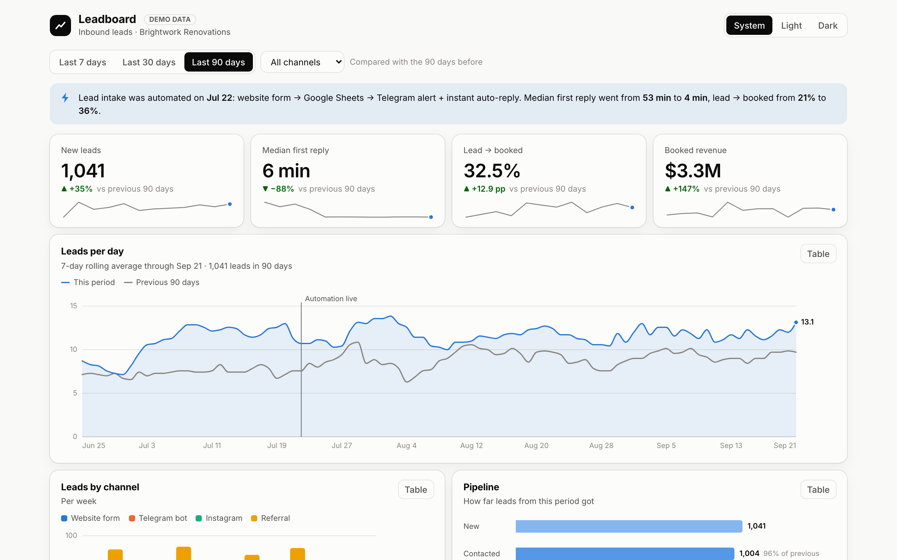
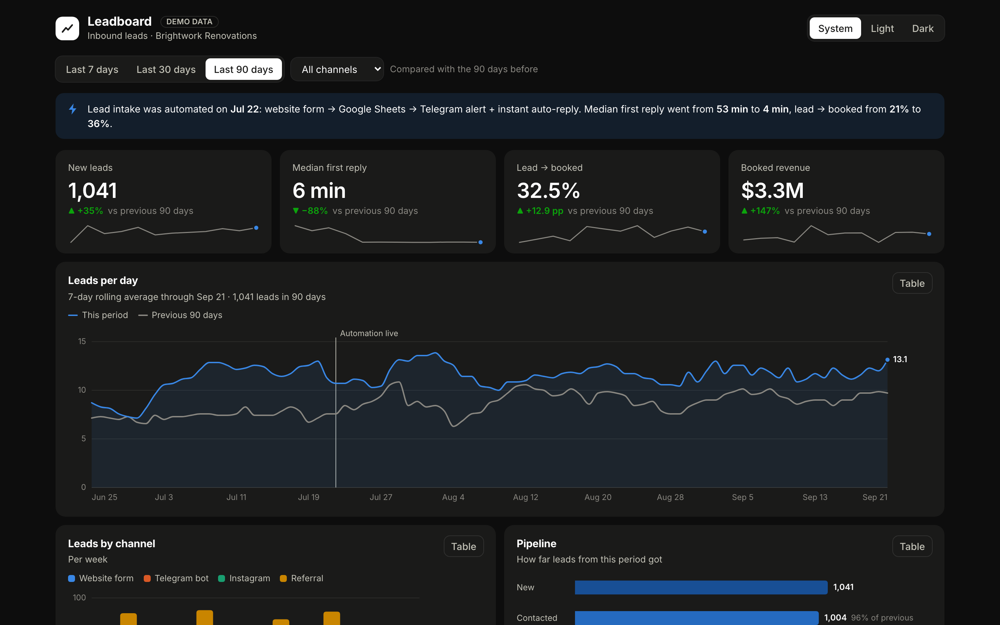
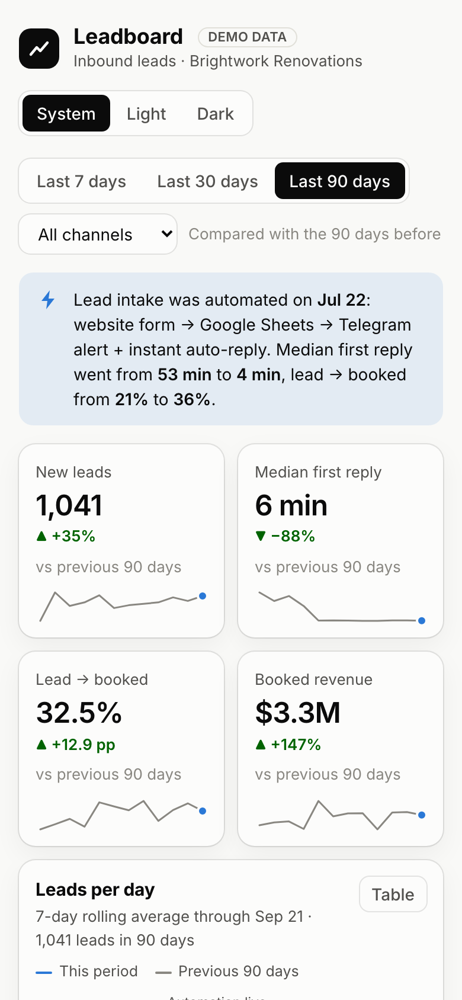

# Leadboard: inbound leads dashboard

**EN** · [RU ниже](#ru)

> Live demo: **[leadboard-ops.vercel.app](https://leadboard-ops.vercel.app)**



## The problem

A small service business gets leads from a website form, a Telegram bot, Instagram and referrals.
The owner can't answer the basic questions: how many leads came in, how fast the team replies, where
leads get stuck, and whether the automation they paid for actually changed anything.

## What it does

One screen, one filter row (date range + channel) that scopes everything below it:

- **KPI tiles:** new leads, median first reply, lead → booked rate, booked revenue. Each tile shows a delta
  against the previous period and a 12-point sparkline. The delta color follows meaning: slower replies are
  red even though the number went up.
- **Leads per day:** a 7-day rolling average against the previous period, with a crosshair tooltip that also
  shows the raw daily count, and an annotation for the day lead intake was automated.
- **Leads by channel:** stacked columns with a legend, direct labels, and a per-column tooltip.
- **Pipeline:** New → Contacted → Qualified → Booked → Paid, with stage-to-stage conversion.
- **When leads come in:** weekday × hour heatmap that shows when to staff the phone.
- **Recent leads:** search, stage filter, sorting, pagination, CSV export.
- Light and dark themes (system / light / dark toggle), responsive down to 360 px.

The demo data tells a story: 62 days ago the business automated lead intake
([the n8n pipeline from my other demo](https://github.com/nondeadted-kwork/lead-automation-n8n)).
Median first reply dropped from ~50 minutes to ~4, and conversion to booked jobs went up.

## Engineering notes

- **No chart library.** Charts are hand-built SVG in React, using only `d3-scale` and `d3-shape` for the math.
  The bundle is 88 KB gzipped.
- **The palette was validated, not eyeballed.** Categorical colors passed a color-vision-deficiency check
  (protanopia/deuteranopia ΔE) in both themes. The funnel uses a single-hue ordinal ramp, the heatmap a
  sequential ramp. Dark mode has its own validated steps instead of an inverted palette.
- **Accessible:** every chart has a **Table** toggle with the same numbers. Tooltips add detail, but no value is
  only reachable through them. Deltas carry ▲/▼ and a sign, so meaning never depends on color alone.
  Sortable headers expose `aria-sort`.
- **Pure data layer:** `src/data/metrics.ts` holds framework-free aggregation functions with 11 unit tests
  (Vitest). React components only render.
- **Deterministic demo data:** `src/data/generate.ts` uses a seeded PRNG to build 190 days of leads, so every
  visitor sees the same shape. To use real data, replace `generateLeads()` with a fetch from your API or
  Google Sheets. The rest of the app stays the same.

**Stack:** React 19, TypeScript, Vite, d3-scale, d3-shape, Vitest. Static build, deployed on Vercel.

## Run it

```bash
npm install
npm run dev        # http://localhost:5173
npm test           # 11 unit tests
npm run build      # type-check + production build → dist/
```

**Deploy to Vercel:** push to GitHub → vercel.com → *Add New Project* → import the repo. Vercel detects Vite
on its own, so there is nothing to configure. Or from the terminal: `npx vercel --prod`.

| | |
|---|---|
|  |  |

---

<a name="ru"></a>
## RU

**Дашборд входящих заявок для малого бизнеса.** Англоязычная витрина.
Живая ссылка: [leadboard-ops.vercel.app](https://leadboard-ops.vercel.app), данные демо-генератора.

- **Задача:** владелец не видит, сколько приходит заявок, как быстро отвечают менеджеры, где заявки теряются
  и что дала автоматизация.
- **Решение:** один экран с фильтрами по периоду и каналу. KPI с динамикой, заявки по дням против прошлого
  периода, каналы, воронка, тепловая карта по часам, таблица заявок с поиском и выгрузкой CSV.
  Светлая и тёмная темы, мобильная версия.
- **Стек:** React 19 + TypeScript + Vite. Графики нарисованы вручную на SVG, без чарт-библиотек
  (из d3 только математика шкал). Бандл 88 КБ gzip, 11 unit-тестов на слой данных.
- **Данные:** генерируются детерминированно (seeded PRNG) в `src/data/generate.ts`. Под заказчика эта функция
  заменяется запросом к его API, Google Таблице или базе.
